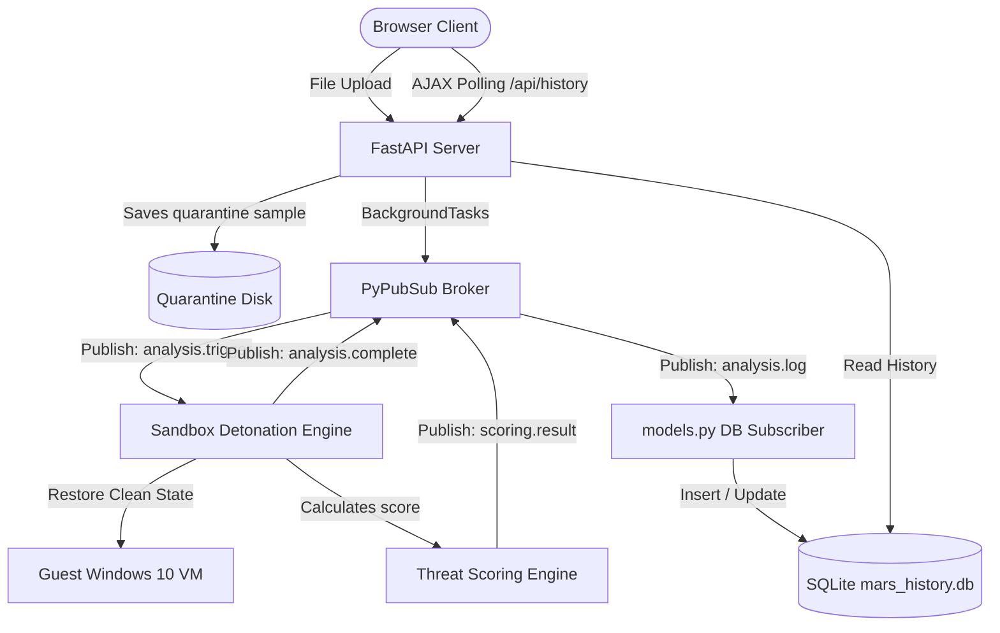

# MARS (Malware Analysis & Reporting System) Web Dashboard

MARS is a production-grade, dual-VM malware detonation sandbox and static analysis engine. This branch migrates the control center from the legacy CustomTkinter GUI to a highly responsive, air-gapped web dashboard built with FastAPI, SQLite (SQLAlchemy), and PyPubSub.

The entire web application runs strictly on `127.0.0.1:8000` with absolute zero reliance on external internet connections or CDNs, adhering to high-security air-gapped analysis requirements.

---

## System Architecture

The web application is decoupled to prevent blocking FastAPI request threads during heavy static PE analysis or guest VM detonation routines. Communication between the web application and the analysis engine is managed via a thread-safe PyPubSub event broker:



---

## Key Features

- **FastAPI Core**: Highly-performant backend server using async routing.
- **Air-Gapped Design System**: Custom Tailwind layout stylesheet hosted entirely locally under `web/static/css/`.
- **Decoupled Detonation Queue**: Web requests return immediately with a `202 Queued` response while PyPubSub queues detonation analysis sequentially behind thread locks.
- **Persistent SQLite Database**: Track analysis progress, timestamps, and overall threat scores automatically.
- **Real-Time Ajax Refresh**: Web dashboard dynamically polls backend states every 2 seconds to transition row badges and threat progress indicators in real-time.

---

## File Walkthrough

### 1. Database Configuration
* **[database/database.py](file:///c:/BHAVYA/Internship/MARS/database/database.py)**: Sets up the SQLAlchemy database engine pointing to `mars_history.db`. Utilizes thread-safe pools for SQLite compatibility across multiple FastAPI worker threads.
* **[database/models.py](file:///c:/BHAVYA/Internship/MARS/database/models.py)**: Maps the `AnalysisHistory` database table. Automatically registers a PyPubSub listener subscribing to the `"analysis.log"` topic to save queue states and threat scores.

### 2. Control Routing
* **[api/routes.py](file:///c:/BHAVYA/Internship/MARS/api/routes.py)**:
  - `POST /upload`: Handles file multi-part streams, calculates SHA-256 hashes, saves files inside the secure quarantine directory, and spawns background tasks.
  - `GET /api/history`: Provides JSON logs of all analysis runs for dynamic dashboard page updates.

### 3. Application Core & Event Bus
* **[main.py](file:///c:/BHAVYA/Internship/MARS/main.py)**:
  - Initializes the FastAPI app, mounts local directories, and sets up template engines.
  - Subscribes to the `"analysis.trigger"`, `"scoring.result"`, and `"analysis.complete"` topics to synchronize sandbox runs.
  - Temporarily resolves extensions (e.g. mapping `hash.malz` to its original extension like `hash.exe` or `hash.zip`) to trigger PE static or package modules.
  - Boots the web server locally using `uvicorn`.

### 4. Interactive Frontend
* **[web/templates/index.html](file:///c:/BHAVYA/Internship/MARS/web/templates/index.html)**: Cybersecurity-themed dark dashboard template. Integrates drag-and-drop file ingestion and registers AJAX updates.
* **[web/static/css/tailwind.css](file:///c:/BHAVYA/Internship/MARS/web/static/css/tailwind.css)**: Local stylesheet mapping custom HSL palettes, glassmorphism card panels, pulsing badges, and custom animation sets.

---

## Directory Layout

```text
MARS/
|-- api/
|   `-- routes.py            # API upload & database history routes
|-- config/
|   `-- config.yaml          # Pipeline thresholds & allowed extensions
|-- core/
|   |-- intake.py            # Hashing and file size validation
|   |-- pipeline.py          # Core static/dynamic orchestration
|   |-- static.py            # PE header mitigations and YARA matching
|   |-- scoring.py           # Threat scoring rule compilation
|   `-- dynamic.py           # VMware automation & serialization Sniffer
|-- database/
|   |-- database.py          # SQLite engine and session factory
|   `-- models.py            # AnalysisHistory ORM & PyPubSub DB listener
|-- rules/
|   `-- rules.yar            # Local YARA database signature compilation
|-- web/
|   |-- static/
|   |   `-- css/
|   |       `-- tailwind.css # Air-gapped stylesheet variables & layout CSS
|   `-- templates/
|       `-- index.html       # HTML UI dashboard page & AJAX poll script
|-- workspace/
|   `-- reports/             # Generated JSON/PDF detonation summaries (Other analysis directories are now stored in the host system's temporary directory)
|-- main.py                  # Web application entrypoint
|-- requirements.txt         # Dependencies
`-- README.md
```

---

## Ingest Queue & Status Logic

When a malware sample is ingested, it traverses these state transitions:

1. **Queued**: The file has been calculated, written to the host's system temporary directory (e.g. `%TEMP%/mars_quarantine/{sha256}.malz`), and entered into the database.
2. **Processing**: The sequential lock is acquired, the clean Win10 VM state is restored, and static/dynamic detonation phases are executed.
3. **Complete**: Execution successfully generates PDF/JSON reports and saves the maximum threat score.
4. **Failed**: An exception occurred during analysis or VM detonation.

| Status Badge | Description | Score Range | Verdict |
| :--- | :--- | :--- | :--- |
| `Queued` | Waiting for detonation slot | - | - |
| `Processing` | Detonation running in VM | - | - |
| `Complete` | Report compiled | `0.0 - 2.9` | `CLEAN` |
| `Complete` | Report compiled | `3.0 - 4.9` | `SUSPICIOUS` |
| `Complete` | Report compiled | `5.0 - 7.4` | `HIGH RISK` |
| `Complete` | Report compiled | `7.5 - 10.0` | `MALICIOUS` |
| `Failed` | Detonation error / timeout | - | - |

---

## Setup & Execution

### 1. Requirements
Ensure Python 3.10+ is installed on the host machine.

### 2. Environment Setup
Activate the virtual environment and install dependencies:
```powershell
# Create and activate environment
python -m venv venv
.\venv\Scripts\Activate.ps1

# Install requirements
pip install -r requirements.txt
pip install fastapi uvicorn sqlalchemy jinja2 python-multipart aiofiles
```

### 3. Execution
Launch the web server:
```powershell
python main.py
```

The console will indicate that the application is online:
```text
======================================================
 MARS - Malware Analysis & Reporting System Dashboard
======================================================
INFO:     Started server process [12872]
INFO:     Waiting for application startup.
INFO:     Application startup complete.
INFO:     Uvicorn running on http://127.0.0.1:8000 (Press CTRL+C to quit)
```

Open `http://127.0.0.1:8000` in your browser to interact with the dashboard.
