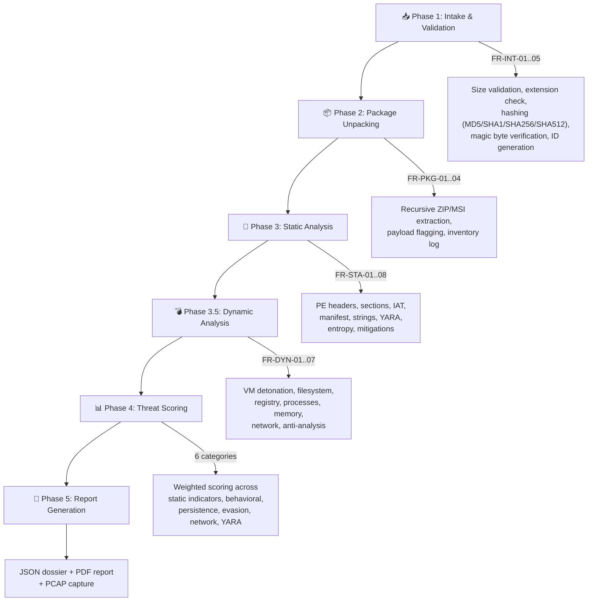

<p align="center">
  <h1 align="center">🛡️ MARS — Malware Analysis & Reverse-engineering System</h1>
  <p align="center">
    <em>An automated, dual-VM malware analysis platform with real-time web dashboard, hybrid static/dynamic analysis pipeline, and forensic-grade reporting.</em>
  </p>
</p>

<p align="center">
  
  
  
  
  
</p>

---

## 📋 Table of Contents

- [Overview](#-overview)
- [Key Features](#-key-features)
- [System Architecture](#-system-architecture)
- [Project Structure](#-project-structure)
- [Analysis Pipeline](#-analysis-pipeline)
- [Detonation Strategies](#-detonation-strategies)
- [Sandbox Agent Architecture](#-sandbox-agent-architecture)
- [Threat Scoring Engine](#-threat-scoring-engine)
- [Web Dashboard](#-web-dashboard)
- [API Reference](#-api-reference)
- [Reporting](#-reporting)
- [Technology Stack](#-technology-stack)
- [Quick Start](#-quick-start)
- [Configuration](#-configuration)
- [Security Considerations](#-security-considerations)

---

## 🔍 Overview

**MARS** (Malware Analysis & Reverse-engineering System) is a comprehensive, automated malware analysis platform designed for security researchers, SOC analysts, and incident response teams. It combines static binary inspection with dynamic behavioral analysis inside an isolated VMware sandbox, streaming real-time telemetry to a web-based dashboard and generating professional forensic reports.

MARS operates on a **dual-VM architecture**: the analyst's host machine (VM A) runs the orchestration server, while a disposable Windows 10 sandbox (VM B) executes the malware under monitored conditions. After every analysis run, the sandbox is reverted to a clean snapshot, ensuring complete isolation.

---

## ✨ Key Features

### Static Analysis
- **PE Header Parsing** — Compilation timestamps, subsystem, entry point, image base, linker version
- **Section Analysis** — Per-section entropy calculation with packing/obfuscation detection
- **Import Address Table (IAT) Inspection** — Flags process injection, memory manipulation, and download APIs
- **YARA Signature Engine** — 10+ rule categories covering known malware, tactical tradecraft, evasion, LotL abuse, and obfuscation
- **String Extraction** — Regex-powered extraction of IPs, URLs, registry paths, emails, and credential patterns
- **Manifest Analysis** — Requested execution level, UAC bypass indicators
- **Security Mitigation Audit** — ASLR, DEP, SEH, CFG, Code Integrity status

### Dynamic Analysis
- **Automated VM Sandbox Detonation** — VMware Workstation integration with snapshot revert, file copy, and remote execution
- **Process Monitoring** — WMI-based process creation tracking with full process tree reconstruction
- **Filesystem Monitoring** — ProcMon CSV parsing for file create/modify/delete/rename events
- **Registry Monitoring** — Registry key/value mutations with persistence mechanism detection
- **Memory Analysis** — DLL injection detection, memory-mapped file tracking
- **Network Interception** — Scapy-based deep packet inspection (DNS, HTTP, TLS/SNI, raw TCP)
- **Anti-Analysis Detection** — VM detection queries, debugger checks, timing attacks
- **Living-off-the-Land (LotL) Detection** — PowerShell, certutil, WMIC, mshta, regsvr32, and 15+ LOLBin patterns
- **Resource Profiling** — CPU utilization tracking with time-series graph generation

### Reporting & Dashboard
- **Real-Time SSE Streaming** — Live log output and module results streamed to the browser
- **Interactive Web Dashboard** — Upload, monitor, and review analyses from a modern web UI
- **Automated PDF Reports** — Professional forensic reports generated via ReportLab
- **JSON Dossier Export** — Machine-readable complete analysis data
- **PCAP Capture** — Network traffic saved for offline analysis in Wireshark
- **Analysis History** — SQLite-backed persistent history with per-run record isolation

---

## 🏗️ System Architecture

```
┌─────────────────────────────────────────────────────────────────────────┐
│                              HOST MACHINE                              │
│                                                                        │
│  ┌────────────────────────── VM A (Analyst) ────────────────────────┐  │
│  │                                                                  │  │
│  │   Browser ◄──── SSE ────► FastAPI Server (main.py :8000)        │  │
│  │                                │                                 │  │
│  │                    ┌───────────┼───────────┐                     │  │
│  │                    ▼           ▼           ▼                     │  │
│  │              ┌──────────┐ ┌────────┐ ┌──────────┐               │  │
│  │              │ Intake   │ │ Static │ │ Package  │               │  │
│  │              │ Module   │ │ Module │ │ Unpacker │               │  │
│  │              └──────────┘ └────────┘ └──────────┘               │  │
│  │                    │                                             │  │
│  │                    ▼                                             │  │
│  │          ┌─────────────────────┐                                 │  │
│  │          │  Dynamic Controller │──── vmrun ────► VM B            │  │
│  │          │  (MalwareSandbox    │                                 │  │
│  │          │   Analyzer)         │◄── Serial Pipe ── Agent        │  │
│  │          └─────────────────────┘                                 │  │
│  │                    │                                             │  │
│  │          ┌─────────┼─────────┐                                  │  │
│  │          ▼         ▼         ▼                                  │  │
│  │    ┌──────────┐ ┌────────┐ ┌──────────┐                        │  │
│  │    │ Scoring  │ │ Report │ │ Network  │                        │  │
│  │    │ Engine   │ │ Gen    │ │ Sniffer  │                        │  │
│  │    └──────────┘ └────────┘ └──────────┘                        │  │
│  │                                                                  │  │
│  └──────────────────────────────────────────────────────────────────┘  │
│                                                                        │
│  ┌────────────────────────── VM B (Sandbox) ────────────────────────┐  │
│  │                                                                  │  │
│  │   ┌──────────────┐  ┌───────────────┐  ┌────────────────────┐  │  │
│  │   │ Sandbox Agent│  │   ProcMon     │  │   FakeNet          │  │  │
│  │   │ (unified or  │  │ (Kernel Trace)│  │ (Network Sim)      │  │  │
│  │   │  two_phase)  │  │              │  │                    │  │  │
│  │   └──────┬───────┘  └──────────────┘  └────────────────────┘  │  │
│  │          │                                                     │  │
│  │          ▼                                                     │  │
│  │   Serial COM1 ──► Named Pipe ──► VM A                         │  │
│  │                                                                │  │
│  └────────────────────────────────────────────────────────────────┘  │
└─────────────────────────────────────────────────────────────────────────┘
```

### Communication Channels

| Channel | Protocol | Purpose |
|---------|----------|---------|
| **Serial Pipe** | `\\.\pipe\sandbox_serial` → COM1 | Real-time telemetry from guest agent to host |
| **VMnet1** | Host-Only Ethernet | Scapy packet capture of sandbox network traffic |
| **vmrun CLI** | VMware VIX API | VM lifecycle management (revert, copy, execute) |
| **SSE** | HTTP Server-Sent Events | Live dashboard updates to browser |
| **PyPubSub** | In-process event bus | Decoupled module-to-module communication |

---

## 📂 Project Structure

```
exe_analyzer/
├── main.py                          # FastAPI application entry point & SSE server
├── config/
│   └── config.yaml                  # Centralized configuration (VM, static, sandbox)
├── api/
│   └── routes.py                    # REST API endpoints (upload, history, downloads)
├── core/
│   ├── intake.py                    # FR-INT: File validation, hashing, metadata
│   ├── package.py                   # FR-PKG: ZIP/MSI recursive unpacking & inventory
│   ├── static.py                    # FR-STA: PE analysis, YARA, strings, entropy
│   ├── dynamic.py                   # FR-DYN: VM orchestration & telemetry processing
│   ├── network.py                   # Scapy packet capture & deep packet inspection
│   ├── scoring.py                   # Threat scoring engine (0-10 scale, 6 categories)
│   ├── report.py                    # PDF & JSON report generation (ReportLab)
│   └── pipeline.py                  # Analysis pipeline orchestrator
├── database/
│   ├── database.py                  # SQLAlchemy engine & session factory
│   └── models.py                    # AnalysisHistory ORM model & PubSub listener
├── sandbox_agents/
│   ├── unified_agents.py            # Standard sandbox agent (runs inside VM B)
│   ├── two_phase_agents.py          # Bifurcated agent (installer→payload handoff)
│   └── tools/
│       ├── Procmon.exe              # Sysinternals Process Monitor
│       └── FakeNet.exe              # Network simulation tool
├── web/
│   ├── templates/
│   │   ├── index.html               # Main dashboard SPA (122 KB)
│   │   └── report.html              # Standalone report viewer page
│   └── static/
│       ├── css/tailwind.css          # Stylesheet
│       └── js/chart.js              # Chart.js for visualizations
├── rules/
│   └── rules.yar                    # YARA ruleset (10+ rule categories)
├── cli/
│   ├── __init__.py
│   └── main.py                      # Command-line interface runner
├── wheels/                          # Pre-built Python wheels for offline install
├── requirements.txt                 # Host + Guest Python dependencies
├── reqs_no_yara.txt                 # Fallback requirements (without yara-python)
├── SETUP.md                         # Installation & configuration guide
├── README.md                        # This file
└── mars_history.db                  # SQLite analysis history (auto-created)
```

---

## ⚙️ Analysis Pipeline

MARS executes a **5-phase sequential pipeline** for every submitted sample:



### Pipeline Module Reference

| Module | File | Functional Requirements |
|--------|------|------------------------|
| **Intake** | `core/intake.py` | FR-INT-01 (size), FR-INT-02 (extension), FR-INT-03 (hashing), FR-INT-04 (metadata), FR-INT-05 (analysis ID) |
| **Package** | `core/package.py` | FR-PKG-01 (recursive unpack), FR-PKG-02 (payload flagging), FR-PKG-03 (hashing), FR-PKG-04 (inventory log) |
| **Static** | `core/static.py` | FR-STA-01 (manifest), FR-STA-02 (PE headers), FR-STA-03 (mitigations), FR-STA-04 (entropy), FR-STA-05 (imports), FR-STA-06 (strings), FR-STA-07 (YARA), FR-STA-08 (packer detection) |
| **Dynamic** | `core/dynamic.py` | FR-DYN-01 (filesystem), FR-DYN-02 (registry), FR-DYN-03 (persistence), FR-DYN-04 (processes), FR-DYN-05 (memory/DLLs), FR-DYN-06 (network), FR-DYN-07 (anti-analysis) |
| **Scoring** | `core/scoring.py` | 6-category weighted scoring, 0.0–10.0 normalized scale, verdict classification |
| **Report** | `core/report.py` | JSON dossier, PDF generation via ReportLab, embedded graphs |
| **Pipeline** | `core/pipeline.py` | Orchestration, cancellation, PubSub event routing |

---

## 🎯 Detonation Strategies

MARS supports four analysis workflows selectable from the web dashboard:

| Strategy | Static | Dynamic | Description |
|----------|--------|---------|-------------|
| **Full Detonation** | ✅ | ✅ | Complete analysis — static inspection followed by VM sandbox detonation |
| **Static Only** | ✅ | ❌ | PE analysis, YARA, strings — no VM interaction |
| **Dynamic Only** | ❌ | ✅ | Sandbox detonation only — skip static phase |
| **Bifurcated** | ✅ | ✅ | Two-phase dynamic: Phase 1 monitors the installer wrapper, Phase 2 monitors the dropped payload |

### Bifurcated Analysis (Two-Phase)

The bifurcated strategy is designed for **installer-based malware** that drops a payload before executing it:

```
Phase 1 (Installer Wrapper)              Phase 2 (Main Payload)
┌─────────────────────────────┐          ┌─────────────────────────────┐
│ • Monitor installer process │    ──►   │ • Track dropped .exe files  │
│ • Capture file drops        │          │ • Monitor payload execution │
│ • Record registry changes   │          │ • Full behavioral analysis  │
│ • Detect persistence setup  │          │ • Process tree expansion    │
│ • Configurable 1-30 min     │          │ • Configurable 1-30 min     │
└─────────────────────────────┘          └─────────────────────────────┘
```

- Uses `two_phase_agents.py` in the sandbox guest
- Employs `PayloadCaptureHandler` (Watchdog) to detect dropped executables
- Streams a `PHASE-2-HANDOFF` telemetry event when payload execution is detected
- Dashboard shows a phase transition alert when Phase 1 completes

### Analysis Duration

All analysis modes support configurable runtime windows between **1 minute and 30 minutes**:
- Standard modes: Single duration slider
- Bifurcated mode: Independent Phase 1 and Phase 2 duration selectors

---

## 🤖 Sandbox Agent Architecture

### Unified Agent (`unified_agents.py`)

The standard sandbox agent that runs inside VM B for `full_detonation`, `static_only`, and `dynamic_only` strategies.

**Monitoring Modules:**
| Module | API/Technique | What It Captures |
|--------|---------------|------------------|
| **FR-DYN-01** (Filesystem) | ProcMon CSV + Watchdog | File create/modify/delete/rename events |
| **FR-DYN-02** (Registry) | ProcMon CSV | Key/value set, delete, create operations |
| **FR-DYN-03** (Persistence) | Registry + Scheduled Tasks + Services | Run keys, startup entries, new services |
| **FR-DYN-04** (Processes) | WMI `Win32_Process` watcher | Process creation tree with LotL classification |
| **FR-DYN-05** (Memory) | ProcMon CSV | DLL loads, memory-mapped files |
| **FR-DYN-06** (Network) | Scapy + FakeNet | DNS queries, HTTP/TLS connections, raw TCP |
| **FR-DYN-07** (Anti-Analysis) | ProcMon CSV | VM detection, debugger queries, timing checks |

**Excluded Processes** (noise filtering):
- `python.exe`, `procmon.exe`, `procmon64.exe`
- VMware tools: `vmtoolsd.exe`, `vmwareuser.exe`, `vmwaretray.exe`, `vmusrvc.exe`, `vgauthservice.exe`

### Two-Phase Agent (`two_phase_agents.py`)

Extended agent for the bifurcated analysis strategy with additional capabilities:
- **PayloadCaptureHandler** — Watchdog-based file creation monitor for `%TEMP%`, `%APPDATA%`, `C:\ProgramData`
- **Phase State Machine** — `INSTALLER_WRAPPER` → `MAIN_PAYLOAD` transition tracking
- **PID Reuse Handling** — Chronological PID tracking (Pass 1b) that correctly handles Windows PID recycling
- **Dropped Payload Tracking** — SHA-256 hashing and path-based tracking of newly created executables

### Telemetry Transport

Both agents communicate with the host via a **serial COM1 named pipe**:

```python
# Agent → Host telemetry frame format
{
    "module": "FR-DYN-01",       # Functional requirement tag
    "event_type": "FILE_CREATE", # Event classification
    "data": { ... },             # Event-specific payload
    "timestamp": "...",          # ISO 8601 timestamp
    "verdict": "SUSPICIOUS"      # Per-event risk classification
}
```

Telemetry is serialized as JSON, length-prefixed with a 4-byte struct header, and transmitted over the serial pipe at 115200 baud.

---

## 📊 Threat Scoring Engine

### Scoring Architecture

The scoring engine (`core/scoring.py`) produces a per-target `ScoringResult` from static and/or dynamic artifacts across **six weighted categories**:

| Category | Weight | Max Points | What It Measures |
|----------|--------|------------|-----------------|
| **Static Indicators** | 25% | 25 | Packing, entropy, suspicious imports, mitigations |
| **Behavioral Actions** | 25% | 25 | Filesystem writes, registry mutations, process spawns |
| **Persistence & Privilege** | 15% | 15 | Autorun entries, services, privilege escalation |
| **Evasion & Anti-Analysis** | 15% | 15 | VM detection, debugger checks, sandbox evasion |
| **Network Activity** | 10% | 10 | DNS queries, HTTP/HTTPS connections, raw sockets |
| **Signature Matches** | 10% | 10 | YARA rule hits, known malware patterns |

### Verdict Scale

Raw scores are normalized to a **0.0–10.0** scale and mapped to verdict labels:

| Score Range | Verdict | Color |
|-------------|---------|-------|
| 0.0 – 2.9 | 🟢 **CLEAN** | `#047857` |
| 3.0 – 4.9 | 🟡 **SUSPICIOUS** | `#D97706` |
| 5.0 – 7.4 | 🟠 **HIGH RISK** | `#B45309` |
| 7.5 – 10.0 | 🔴 **MALICIOUS** | `#BE1414` |

### Confidence Levels

| Level | Criteria |
|-------|----------|
| **LOW** | Only one analysis phase ran, or fewer than 3 scoring signals |
| **MEDIUM** | Both phases present, 3–7 signals |
| **HIGH** | Both phases present, 8+ signals |

---

## 🖥️ Web Dashboard

The MARS web dashboard is a single-page application served from `web/templates/index.html`. Key features:

### Upload Panel
- Drag-and-drop or browse file upload
- Analysis type selector: Full Detonation / Static Only / Dynamic Only / Bifurcated
- Duration slider (1–30 minutes)
- Bifurcated mode: Independent Phase 1 and Phase 2 duration controls
- Execution mode: Detonate / Auto-Install

### Live Analysis View
- **Real-time log stream** — SSE-powered live output from the analysis pipeline
- **Module result cards** — Intake, Static, Dynamic results appear as they complete
- **Threat score gauge** — Animated verdict display with category breakdowns
- **Phase transition alerts** — Bifurcated mode shows alerts when Phase 1 → Phase 2 handoff occurs

### Analysis History
- Persistent table of all past analyses
- Per-run isolation — each upload creates a unique history record
- Click to reload any past analysis with full results
- Status indicators: Queued, Processing, Complete, Failed, Terminated

### Report Downloads
- **JSON Dossier** — Complete machine-readable analysis data
- **PDF Report** — Professional forensic report with embedded graphs
- **PCAP Capture** — Network traffic for offline Wireshark analysis

---

## 🔌 API Reference

### Core Endpoints

| Method | Endpoint | Description |
|--------|----------|-------------|
| `GET` | `/` | Web dashboard (HTML) |
| `POST` | `/upload` | Submit a file for analysis |
| `GET` | `/stream/{sha256}` | SSE event stream for live analysis updates |
| `GET` | `/api/results/{id_or_sha256}` | Fetch complete analysis results (JSON) |
| `GET` | `/api/status/{sha256}` | Check analysis status |
| `GET` | `/api/history` | List all analysis history records |
| `GET` | `/api/artifacts/{sha256}` | Check available downloadable artifacts |
| `POST` | `/api/terminate/{sha256}` | Terminate a running analysis |
| `GET` | `/report/{id_or_sha256}` | Rendered report page (HTML) |

### Download Endpoints

| Method | Endpoint | Description |
|--------|----------|-------------|
| `GET` | `/download/report/json/{id_or_sha256}` | Download JSON dossier |
| `GET` | `/download/report/pdf/{id_or_sha256}` | Download/regenerate PDF report |
| `GET` | `/download/pcap/{id_or_sha256}` | Download PCAP network capture |
| `GET` | `/download/extracted/{id_or_sha256}/{filename}` | Download extracted file from archive |

### Upload Request

```bash
curl -X POST http://localhost:8000/upload \
  -F "file=@sample.exe" \
  -F "analysis_type=full_detonation" \
  -F "analysis_duration=120" \
  -F "analysis_mode=detonate"
```

### Response (202 Accepted)
```json
{
  "status": "Queued",
  "sha256": "a1b2c3d4e5...",
  "filename": "sample.exe",
  "analysis_type": "full_detonation",
  "analysis_duration": 120,
  "analysis_mode": "detonate"
}
```

---

## 📄 Reporting

### JSON Dossier Structure

```json
{
  "Analysis_Summary": {
    "Analysis ID": "MARS-sample_exe-A1B2C3",
    "Original File Name": "sample.exe",
    "SHA256": "...",
    "File Size (Bytes)": 123456,
    "Analysis Type": "full_detonation"
  },
  "Static_Analysis_Results": {
    "sample.exe": {
      "PE Headers": { ... },
      "Sections": { ... },
      "Suspicious Imports": { ... },
      "YARA Signatures": { ... },
      "Strings Analytics": { ... }
    }
  },
  "Dynamic_Analysis_Results": {
    "sample.exe": {
      "Filesystem": [ ... ],
      "Registry": [ ... ],
      "Processes": [ ... ],
      "Network": [ ... ],
      "Hardware": [ ... ]
    }
  },
  "Dynamic_Summary": {
    "sample.exe": {
      "files_created": 12,
      "registry_changes": 45,
      "processes_spawned": 3,
      "persistence_mechanisms": 1
    }
  },
  "Scoring_Results": {
    "sample.exe": {
      "verdict": "MALICIOUS",
      "total_score": 8.5,
      "confidence": "HIGH",
      "categories": [ ... ]
    }
  },
  "Package_Extraction": [ ... ]
}
```

### PDF Report

The PDF report is generated using ReportLab and includes:
- Cover page with verdict badge, risk score, and file metadata
- Analysis summary with hash values and timestamps
- Static analysis breakdown (PE headers, imports, YARA matches, strings)
- Dynamic analysis behavioral summary (filesystem, registry, processes, network)
- Threat scoring breakdown with per-category findings
- CPU utilization graph (time-series area chart)
- Process tree visualization

---

## 🛠️ Technology Stack

### Host Application (VM A)

| Technology | Purpose |
|------------|---------|
| **Python 3.12+** | Core runtime |
| **FastAPI** | Async web framework and REST API |
| **Uvicorn** | ASGI server |
| **Jinja2** | HTML template rendering |
| **SQLAlchemy** | ORM for SQLite database |
| **PyPubSub** | Thread-safe decoupled event bus |
| **pefile** | PE executable parsing |
| **yara-python** | YARA signature scanning engine |
| **ReportLab** | PDF report generation |
| **Scapy** | Deep packet inspection & network sniffing |
| **psutil** | Process and resource monitoring |
| **NetworkX** | Process tree graph data structure |
| **Matplotlib** | CPU utilization chart rendering |
| **PyYAML** | Configuration file parsing |

### Sandbox Agent (VM B)

| Technology | Purpose |
|------------|---------|
| **pyserial** | COM1 serial port telemetry streaming |
| **psutil** | Process discovery and resource sampling |
| **pywin32** | Windows API access (registry, services) |
| **WMI** | Windows Management Instrumentation events |
| **Watchdog** | Filesystem event monitoring |

### External Tools (VM B)

| Tool | Purpose |
|------|---------|
| **ProcMon** (Sysinternals) | Kernel-level process/file/registry tracing |
| **FakeNet** | Simulated network services for sandbox |

---

## 🚀 Quick Start

```bash
# 1. Clone and enter the project
git clone <repository-url> exe_analyzer
cd exe_analyzer/exe_analyzer

# 2. Create and activate a virtual environment
python -m venv venv
venv\Scripts\activate

# 3. Install dependencies
pip install -r requirements.txt
# Or for offline/air-gapped systems:
# python -m pip install --no-index --find-links=wheels -r requirements.txt

# 4. Edit configuration
# Update config/config.yaml with your VM paths and credentials

# 5. Start the server
python main.py

# 6. Open the dashboard
# Navigate to http://localhost:8000
```

> For detailed installation instructions including VM setup and configuration, see **[SETUP.md](SETUP.md)**.

---

## ⚙️ Configuration

All configuration is centralized in `config/config.yaml`:

| Section | Key Settings |
|---------|-------------|
| **system** | `max_file_size_gb`, `allowed_extensions`, `max_unpack_depth` |
| **static_analysis** | `yara_rules_path`, `entropy_threshold`, `suspicious_imports` list |
| **sandbox** | `vmrun_path`, `vmx_path`, `snapshot_name`, `guest_user`, `guest_pass`, `serial_pipe`, `network_interface` |

---

## 🔒 Security Considerations

> [!CAUTION]
> MARS is designed to **execute live malware**. Follow these security practices:

1. **Network Isolation** — The sandbox VM (VM B) must use a **host-only** network. Never connect it to the internet or your production network.
2. **Snapshot Discipline** — Always revert to a clean snapshot after every analysis run. MARS does this automatically.
3. **Host AV Exclusions** — Add `%TEMP%\mars_workspace\` to your host antivirus exclusion list to prevent sample quarantine during processing.
4. **Credential Management** — Change the default `guest_pass` in `config.yaml`. Never use production credentials.
5. **Access Control** — MARS binds to `localhost:8000` by default. Do not expose to untrusted networks without authentication.
6. **Sample Retention** — Uploaded samples are stored in the quarantine directory during processing and deleted after analysis completes. Archived reports persist in `workspace/reports/`.

---

<p align="center">
  <em>Built for security researchers who need answers, not just alerts.</em>
</p>
